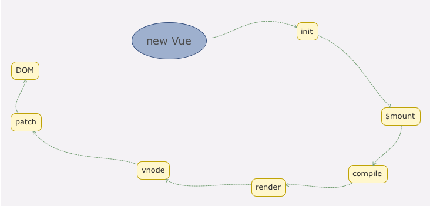

## 数据驱动

```js
{{message}}

new Vue({
  el: '#el',
  data: {
    message: 'hellow world'
  }
})
```

message被渲染到了html，这是如何做到的。
```js
function Vue (options) {
  // 只允许vue实例
  if (process.env.NODE_ENV !== 'production' &&
    !(this instanceof Vue)
  ) {
    warn('Vue is a constructor and should be called with the `new` keyword')
  }
  this._init(options)
}

// 每一个mixin主要功能是往Vue的原型上混入一些方法属性
initMixin(Vue)
```

这个是定义Vue的函数，当我们new Vue时，执行了_init方法，这个init方法就是定义在`./init.js`中。我们可以在这里打断点查看，这样更直观。
```js
initLifecycle(vm)
initEvents(vm)
initRender(vm)
callHook(vm, 'beforeCreate')
initInjections(vm) // resolve injections before data/props
initState(vm)
initProvide(vm) // resolve provide after data/props
callHook(vm, 'created')
```
可以看到这个函数中初始化很多东西，比如合并配置，初始化生命周期，初始化render，hook，初始化state，event等。但是最终他执行的是
```js
if (vm.$options.el) {
  vm.$mount(vm.$options.el)
}
```
通过断点分析，执行$mount后页面message被替换为`hello world`。所以我们将重点放到这个mount函数上

## vue挂载实现

`$mount`的定义是在入口文件，我们分析的是compiler版本，所以看`entry-runtime-with-compiler.js`文件，
这里的`$mount`方法是在`runtion/index`中最初定义的。我们查看实际的`$mount`函数，
调用的是`mountComponent`函数，这个方法在`core/instance/lifecycle`中。
在这个方法中我们创建了`watcher`实例,这个实例的回调我们调用了`updateComponent`方法，
重点关注这个方法中的两个函数`vm._render` 和 `vm._update`。

## render方法
`vm._render`定义在`core/instance/render`中，
```js
Vue.prototype._render = function (): VNode {
  const vm: Component = this
  const { render, _parentVnode } = vm.$options
  ...
  let vnode
  try {
    // There's no need to maintain a stack because all render fns are called
    // separately from one another. Nested component's render fns are called
    // when parent component is patched.
    currentRenderingInstance = vm
    // 返回的vnode实际上是通过render，这个render函数接受一个参数就是createElement函数。我们已经知道createElement的用法
    vnode = render.call(vm._renderProxy, vm.$createElement)
  }
```
可以看到，_render的最终目的就是将实例渲染成一个虚拟DOM，这里重要的是render的调用。我们已经知道render函数的第一个参数就是createElement
```html
<div>
  {{message}}
</div>
```
也可以写作
```js
render: function(createElement) {
  return createElement('div', this.meesage)
}
```
而`vm.$createElement`定义在`initRender`函数中，

## 虚拟dom
render函数将实例转为虚拟dom，我们先了解一下虚拟dom。在浏览器中频繁大量的操作dom不仅繁琐，而且对性能也不好。所谓虚拟dom就是将真实dom解析成一个大的js对象，因为他只是一个映射，没有DOM的操作方法，所以是很轻量级的。vue中虚拟节点描述在`core/vdom/vnode.js`中。他只是借助[snabbdom](https://github.com/snabbdom/snabbdom)实现的的vue特色的vnode。如果以后使用，可以看这个库。

而虚拟dom要映射到真实dom，还需要经过create，diff，patch等过程，接下来我们分析`createElement`

## createElement
`createElement`函数定义在`vdom/create-element.js`中。`createElement`是对`_createElement`的二次封装，为了使用上的更灵活，直接看`_createElement`函数。可以看到传入的参数，然后生成虚拟DOM，这里面有很多逻辑，我们主要分析两个，一个是规范子节点的操作，另一个是虚拟节点的创建

### 规范子节点的操作
`normalizeChildren`和`simpleNormalizeChildren`是根据参数`normalizationType`的不同，这个其实是在`render.js`中初始化时传入的，针对的就是用户手写render和编译自用。
这两个方法都在`src/core/vdom/helpers/normalzie-children.js`中

这两个方法目的就在于规范化children子节点。这里的子节点可能有函数式组件，textNode，render编译后的

### 虚拟DOM生成
规范化子节点后，再去完成createElement的主功能，生成VNode，然后返回。children是一个VNode，children中有children，一起组成一个VNode树，描述了一个完整的DOM。回到`mountComponent`方法，我们已经知道了解了render是如何将DOM描述成vnode，再来看vnode如何还原成dom。这是通过`update`实现的。

## update
update的使用第一次是在初始化渲染，后面的触发则是在数据响应式变化时。他的函数定义是在`lifecycle`中，可以看到`update`最重要的和新方法就是`__patch__`方法。我们全局搜索可以看到，这个方法针对不同的平台，web和weex都有不同的封装。web的patch定义在`runtime/patch.js`中，它实际上调用的是
`core/vdom/patch`导出的`createPatchFunction`方法。该方法是一个逻辑很复杂的函数，但他最终返回一个patch函数，赋给了`_update`的`__patch__`供其调用

> 思考一下，为什么vue要绕一个大圈，将相关代码分散在各个目录文件。因为patch是平台相关的，他将虚拟DOM映射到“不同平台DOM”的方式是不一样的，而且传入的相关操作，比如nodeOps，modules也不一样。所以这些方式是托管在platform文件夹下

> patch的主要逻辑是一样的，所以这个逻辑是放在core文件夹下。而且通过createPatchFunction函数将差异化参数提前固化，这样，不用每次调用patch都要传入nodeOps和modules了。这种函数柯里化方式很值得我们学习。

回到__patch__方法，可以看到传入了4个参数.
```js
return function patch (oldVnode, vnode, hydrating, removeOnly) {
  // tudo
}
```
oldVnode: 表示旧的vnode节点，他可以不存在或者是一个dom
vnode：表示执行_render后返回的vnode
hydrating：表示是否服务端渲染
removeOnly：这个是给transition-group使用的

这个函数过于复杂，我们直接看demo运行
```js
var app = new Vue({
  el: '#app',
  render: function (createElement) {
    return createElement('div', {
      attrs: {
        id: 'app'
      },
    }, this.message)
  },
  data: {
    message: 'Hello Vue!'
  }
})
```
我们模拟一下这段代码的运行。这里的oldVnode就是#app这个dom，这是在mountComponent的时候做的，然后vnode是调用_render生成vnode。
